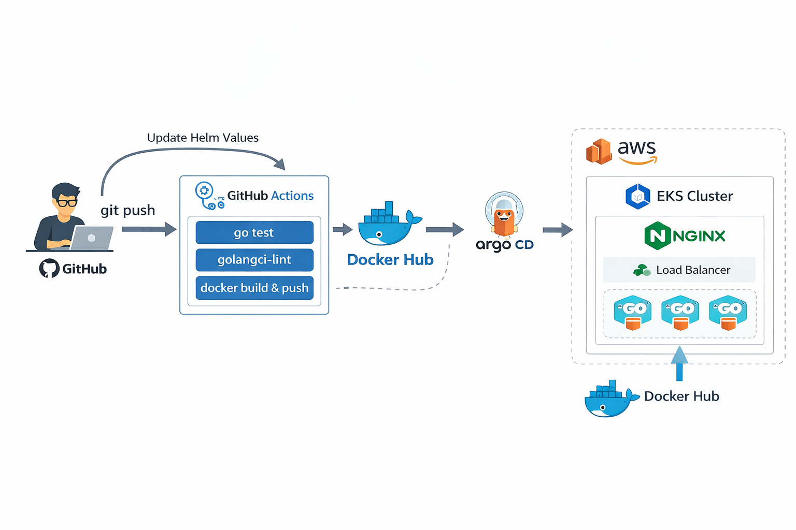

# 🚀 Pipeline DevOps pour Application Go

> Un projet complet illustrant une chaîne d'Intégration et de Déploiement Continus (CI/CD) moderne avec Go, Docker, GitHub Actions, Helm et Kubernetes.

<p align="center">
  <!-- EMPLACEMENT POUR LE SCHÉMA D'ARCHITECTURE -->
  
  <br>
  
</p>

---

## 📖 Présentation du Projet

Ce projet est une vitrine technique démontrant les meilleures pratiques **DevOps et GitOps**. Il s'articule autour d'une application web développée en **Go (Golang)** et déploie un pipeline CI/CD complet, de la conception du code jusqu'au déploiement de l'application.

Il est pensé pour être **clair, modulaire et facile à comprendre** par n'importe quel développeur ou recruteur souhaitant évaluer des compétences en automatisation et orchestration de conteneurs. L'interface propose plusieurs routes simples (`/home`, `/courses`, `/about`, `/contact`).

## 🛠️ Technologies & Outils Utilisés

* **Langage & Web Server :** Go 1.22+
* **Conteneurisation :** Docker (utilisation de *Multi-stage builds* et de l'image de base *Distroless* pour garantir un conteneur final sécurisé et extrêmement léger)
* **Intégration Continue (CI) :** GitHub Actions
* **Qualité du Code :** GolangCI-Lint
* **Orchestration :** Kubernetes (K8s)
* **Automatisation / Déploiement (CD) :** Helm (Gestion complète des paquets Kubernetes)

---

## ⚙️ Architecture du Pipeline CI/CD

Le workflow automatisé se déclenche à chaque nouveau `push` sur la branche `main` (fichier `.github/workflows/cicd.yaml`) :

1. 🧪 **Build & Test :** Compilation du code Go et exécution automatique des tests unitaires (`go test`).
2. 🧹 **Analyse de Qualité :** Vérification stricte du code avec l'outil de référence `golangci-lint` encapsulé dans Docker.
3. 📦 **Conteneurisation :** Création d'une image Docker optimisée puis publication sur DockerHub de manière sécurisée.
4. 🚀 **Mise à jour GitOps :** Le pipeline met à jour automatiquement la version de l'image (tag Docker) directement dans le Chart Helm. Cette action permettra aux contrôleurs synchronisés au repo (comme ArgoCD, Flux) d'appliquer automatiquement ce nouveau déploiement sur Kubernetes.

---

## 📂 Structure du Projet

L'architecture du référentiel est standardisée de la manière suivante :

- `main.go` & `static/` : Code source de l'application web Go et ses pages HTML associées.
- `Dockerfile` : Recette de construction de l'image Docker avec approche multi-step.
- `.github/workflows/` : Pipeline d'Intégration Continue GitHub Actions.
- `helm/go-web-app-chart/` : Configurations dynamiques Helm utilisées pour déployer et maintenir l'application sur K8s.
- `k8s/manifests/` : Manifests natifs Kubernetes classiques (Deployment, Service, Ingress) en alternative à Helm.

---

## 🚀 Comment lancer le projet en local ?

### 1️⃣ Lancement rapide en direct (Nécessite Go d'installé)

Assurez-vous d'avoir **Go** configuré sur votre environnement.

```bash
# Télécharger les modules et lancer le serveur
go run main.go
```
👉 Accédez à l'application via `http://localhost:8080/home`.

### 2️⃣ Lancement sécurisé avec Docker

```bash
# Construire l'image Docker en local
docker build -t go-web-app:v1 .

# Lancer le conteneur et exposer le port 8080
docker run -p 8080:8080 go-web-app:v1
```

### 3️⃣ Déploiement avancé sur Kubernetes (via Helm)

Idéalement à utiliser sur un cluster local comme **Minikube** ou **Kind** avec `kubectl` et `helm` d'installés :

```bash
# 1. Se positionner dans le répertoire root
cd helm

# 2. Déployer l'application sur le cluster en un seul coup
helm upgrade --install pipeline-go-app ./go-web-app-chart
```

---

## 🤝 Conclusion
Ce projet illustre une véritable approche résiliente pour la mise en production de microservices. L'accent est mis sur l'automatisation intégrale, la sécurité (images distroless limitant les vulnérabilités) et l'aspect modulaire apporté par Helm pour Kubernetes.
